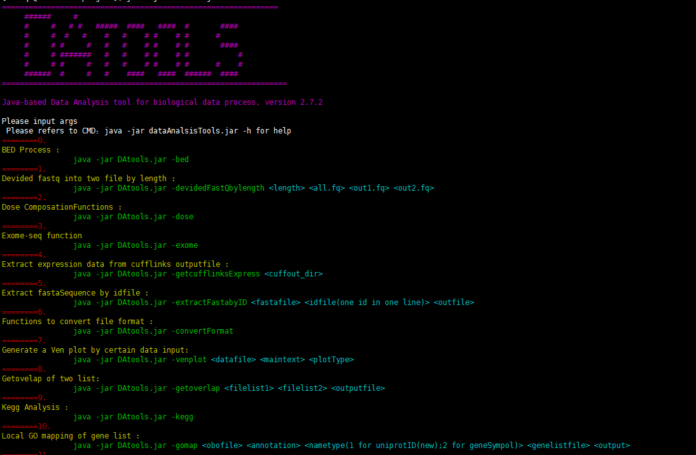

# DAtools
DAtools is a command tool kit for gathering common data analysis scripts using java language, which was mainly developed and run myself. This project provided series of analysis function as well as pipeline applying for daily data analysis tasks.

##Screen shoot of DAtools


##Function gallary

***0.	BED Process :***<br/>
		```	java -jar DAtools.jar -bed```<br/>
***1.	Devided fastq into two file by length :***<br/>
		```	java -jar DAtools.jar -devidedFastQbylength length all.fq out1.fq out2.fq```<br/>
***2.	Dose ComposationFunctions :***<br/>
		```	java -jar DAtools.jar -dose```<br/>
***3.	Draw genelength Distribution :***<br/>
		```	java -jar DAtools.jar -genelengthDis```<br/>
***4.	Exome-seq function***<br> 
		```	java -jar DAtools.jar -exome```<br/>
***5.	Extract expression data from cufflinks outputfile :***<br> 
		```	java -jar DAtools.jar -getcufflinksExpress cuffout_dir```<br/>
***6.	Extract fastaSequence by idfile :***<br/>
		```	java -jar DAtools.jar -extractFastabyID fastafile idfile(one id in one line) outfile)```<br/>
***7.	Functions to convert file format :***<br/>
		```	java -jar DAtools.jar -convertFormat ```<br/>
***8.	Generate a Ven plot by certain data input:***<br/>
		```	java -jar DAtools.jar -venplot datafile maintext plotType```<br/>
***9.	Getovelap of two list with unique output:***<br/>
		```	java -jar DAtools.jar -getoverlap filelist1 filelist2 outputfile uniqueA uniqueB```<br/>
***10.	Getovelap of two list:***<br/>
		```	java -jar DAtools.jar -getoverlap filelist1 filelist2 outputfile```<br/>
***11.	Kegg Analysis :***<br/>
		```	java -jar DAtools.jar -kegg ```<br/>
***12.	Local GO mapping of gene list :***<br/>
		```	java -jar DAtools.jar -gomap obofile annotation nametype(1 for uniprotID(new);2 for geneSympol) genelistfile output```<br/>
***13.	MetaGenome analysis :***<br/>
		```	java -jar DAtools.jar -meta```<br/>
***14.	Multi mapfile merged to matrix***<br/>
		```	java -jar DAtools.jar -multi2matrix  dir suffix outputfile  ```<br/>
***15.	Procesing FastQ files :***<br/>
		```	java -jar DAtools.jar -fastqP```<br/>
***16.	Process Fasta files***<br/>
		```	java -jar DAtools.jar -Fasta```<br/>
***17.	Processing Excel format :***<br/>
		```	java -jar DAtools.jar -excel ```<br/>
***18.	RNAseq Differential Expression Analysis(M):***<br/>
		```	java -jar DAtools.jar -RNAseqDE -mode WR(orSC) condition1 condition2 outputfile ```<br/>
***19.	RNAseq Mappng/quantitifaction(M):***<br/>
		```	java -jar DAtools.jar -RNAseqpipe <fastq1> <fastq2> <library> <gtf>```<br/>
***20.	Remove SUMO-FC adaptors :***<br/>
		```	java -jar DAtools.jar -removeAdapter fastafile adapter(TATA,CACA,GAGA) type(N/C)```<br/>
***21.	Seperate fastq File by index :***<br/>
		```	java -jar DAtools.jar -sepFastq fastaqfile indexmapfile```<br/>
***22.	SepfastaFilebyIndex :***<br/>
		```	java -jar DAtools.jar -sepFastabyIndex fastafile indexlist(TATA,CACA,GAGA)```<br/>
***23.	Shorter sequencename of genome seq to parse gtg files :***<br/>
		```	java -jar DAtools.jar -genomenamecut genome.fa out.fa ```<br/>
***24.	Split the xml file generated by blast :***<br/>
		```	java -jar DAtools.jar -BlastXMLsplit fileinputxml seqnumber```<br/>
***25.	Summary the unigenes distribution with trinity's output(Decreased) :***<br/>
		```	java -jar DAtools.jar -unigenedistribution isunigene trinity.fasta```<br/>


##Designers:
Qi Zhao, zhaoqi3@mail2.sysu.edu.cn<br/>

## Developers:
Qi Zhao, zhaoqi3@mail2.sysu.edu.cn <br/>


## Maintainer:
Qi Zhao <br/>
Please feel free contact us. <br/>

## Copyright


## Citation 
Not implemented yet 
